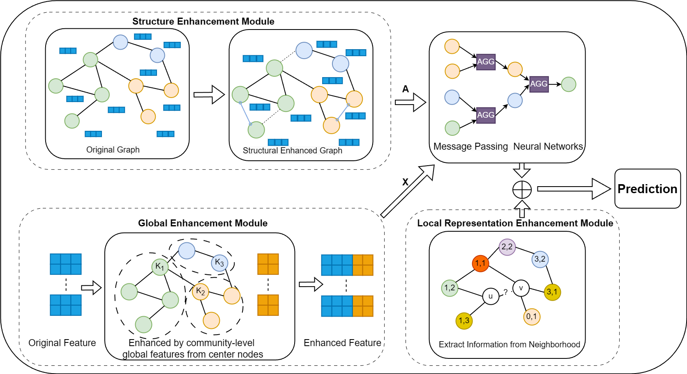

# Code for Community-Enhanced Link Prediction (CELP)
[A Community-Enhanced Graph Representation Learning Model for Link Prediction](https://arxiv.org/abs/2512.21166)

Authors: Lei Wang, Darong Lai




## Environment Setting
- `torch==1.12.1+cu113`，`torchvision==0.13.1+cu113`（CUDA 11.3�
- `torch_geometric==2.5.3`
- `torch-scatter==2.1.0+pt112cu113`，`torch-sparse==0.6.16+pt112cu113`，`torch-cluster==1.6.0+pt112cu113`，`torch-spline-conv==1.2.1+pt112cu113`
- `ogb==1.3.6`，`networkx==2.8.8`
- `torch-hd==5.6.3`
- `numpy==1.24.1`，`scipy==1.10.1`，`scikit-learn==1.4.2`，`pandas==2.2.2`
- `matplotlib==3.8.4`，`seaborn==0.13.2`

## Data Preparation
Part of the data has been included in the repository at `./data/`. For the rest of the data, it will be automatically downloaded by the code.

## Usage

To run experiments:
```
python clustering_collab.py Cora 5
python main.py --dataset=Cora --batch_size=2048 --use_degree=mlp --minimum_degree_onehot=60 --mask_target=True
```

In CELP, there are couple of hyperparameters that can be tuned, including:

- `--dataset`: the name of the dataset to be used.
- `--predictor`: the predictor to be used. It can be `CELP` or `CELP+`.
- `--batch_size`: the batch size.
- `--signature_dim`: the node signature dimension `F` in CELP.
- `--mask_target`: whether to mask the target node in the training set to remove the shortcut.
- `--use_degree`: the methods to rescale the norm of random vectors.
- `--minimum_degree_onehot`: the minimum degree of hubs with onehot encoding to reduce variance.


## Experiment Reproduction

<details>
<summary>Commands to reproduce the results of CELP reported in the paper</summary>

### Cora
--dataset=Cora --predictor=CELP --batch_size=512 --patience=50 --log_steps=1  --xdp=0.7 --feat_dropout=0.05 --label_dropout=0.2 --weight_decay=0.001 --lr=0.0015 --metric=Hits@100

### Citeseer
--dataset=Citeseer --predictor=CELP --batch_size=1152 --patience=60 --log_steps=1  --xdp=0.4 --feat_dropout=0.1 --label_dropout=0.1 --weight_decay=0.0009 --lr=0.0035 --metric=Hits@100 --use_degree=mlp --use_embedding=True

### Pubmed
--dataset=Pubmed --predictor=CELP --batch_size=2048 --patience=50 --log_steps=1  --xdp=0.3 --feat_dropout=0.05 --label_dropout=0.2 --weight_decay=0.001 --lr=0.0034 --metric=Hits@100 --use_degree=mlp --use_embedding=True

### Computers
```
python main.py --dataset=computers --predictor=CPLP+ --xdp=0.1 --feat_dropout=0.2 --label_dropout=0.2 --batch_size=4096 --use_degree=mlp --minimum_degree_onehot=80 --use_embedding=True --patience=40
```
### Photo
```
python main.py --dataset=Photo --predictor=CPLP+ --xdp=0.5 --feat_dropout=0.05 --label_dropout=0.6 --batch_size=4096 --use_degree=mlp --minimum_degree_onehot=80 --lr=0.01 --use_embedding=True --batchnorm_affine=False --patience=40
```
### Collab
```
python main.py --dataset=ogbl-collab --predictor=CPLP+ --use_embedding=True --batch_size=32768 --use_degree=mlp --patience=40 --log_steps=1 --year=2010 --use_valedges_as_input=True --xdp=0.8 --feat_dropout=0.6 --label_dropout=0.4
```


</details>


## Citation
If you find this repository useful in your research, please cite the following paper:
```
@article{wang2025community,
  title={A Community-Enhanced Graph Representation Model for Link Prediction},
  author={Wang, Lei and Lai, Darong},
  journal={arXiv preprint arXiv:2512.21166},
  year={2025}
}
```
